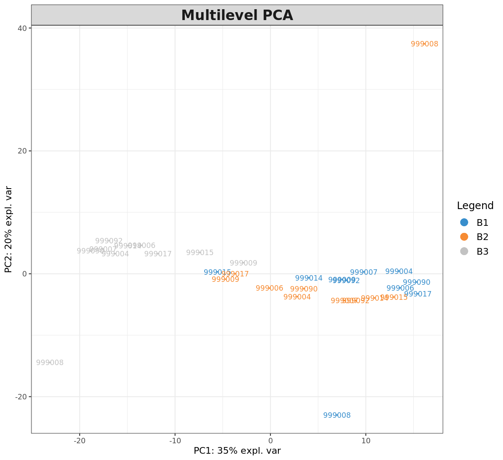
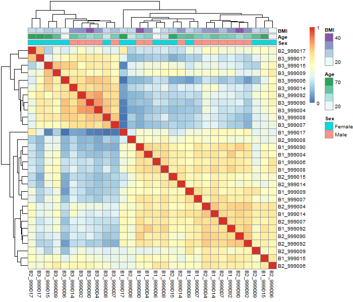

```{r setup, include=FALSE}
knitr::opts_chunk$set(echo = TRUE)
```

## Principal Component Analysis
A common goal in many of ProteoMill’s functionalities is to reduce data complexity, and to provide a framework for extracting elements of biological relevance. PCA is a technique that describes dimensions of large variability in a dataset. The datapoints cluster together based on the similarity of their expression profiles.

{width=450px}

### UMAP

Uniform Manifold Approximation and Projection (UMAP) is a dimension reduction technique that can be used for visualisation similarly to t-SNE, but also for general non-linear dimension reduction.

### Sample-sample correlation heatmap

Another approach to assess whether samples tend to cluster together is to plot sample-sample correlations as a heatmap. This method can be used to detect outliers and abnormalities in a sample. If you have uploaded annotation data, this heatmap will be presented with annotations.

 
