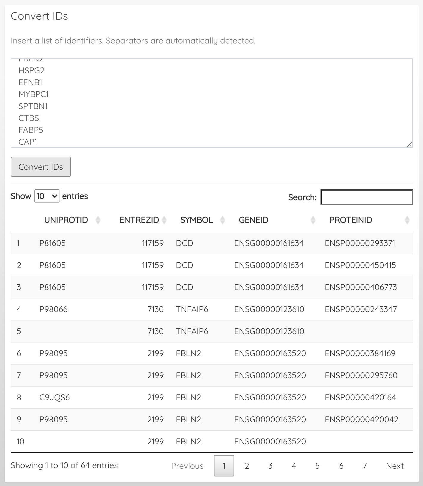
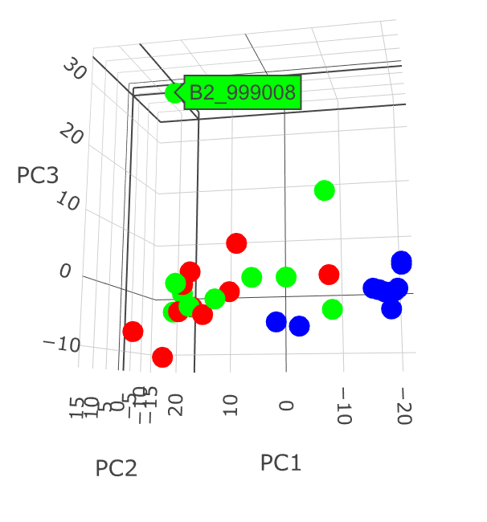

```{r setup, include=FALSE}
knitr::opts_chunk$set(echo = TRUE)
```

##### November 04, 2020

* ProteoMill automatically detects and converts identifiers, but there is now a dedicated tool for converting arbitrary identifier lists between ID types.

{width=350px}

* Improved functionality for generating report

##### October 26, 2020

* 3D PCA plots now show sample names on hover

{width=300px}

* Added splash-screen video

* Samples can be excluded (Dataset options > Data summary > Include/exclude samples)